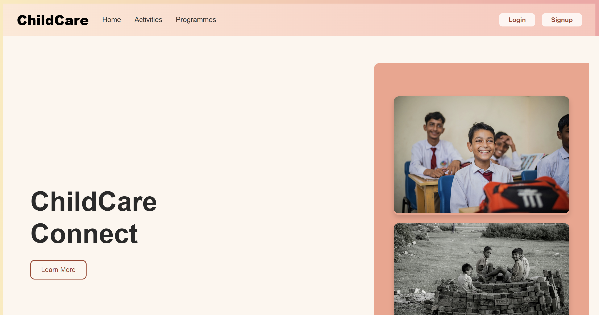
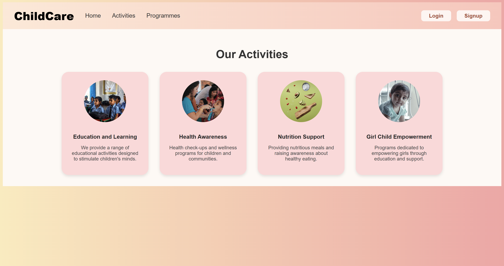
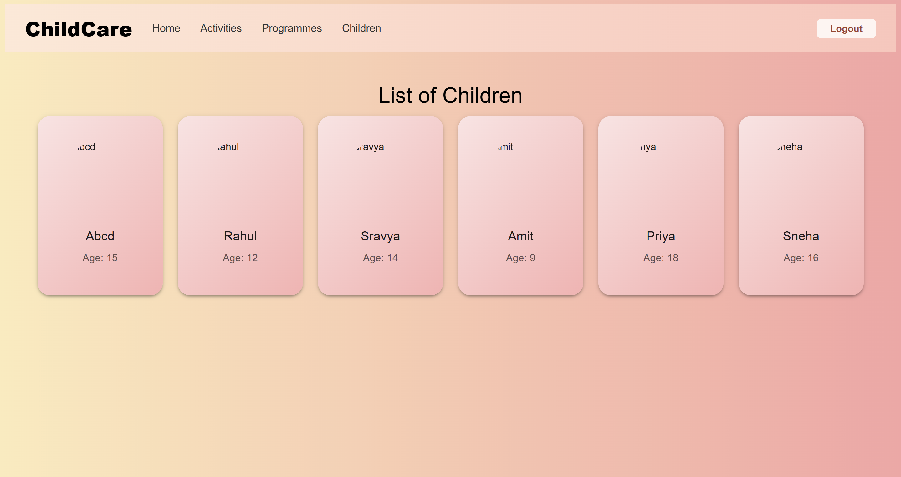

# 👶 ChildCare Connect – Full-Stack NGO Platform

ChildCare Connect is a full-featured NGO platform designed to help non-profits manage events, showcase children’s profiles, and enable seamless online donations. It offers a responsive, user-friendly experience with secure authentication, real-time validation, and event planning support.


## ✨ Features

- 🔐 **Secure Authentication**  
  Bcrypt-based login/signup system with proper token management.

- 🧒 **Children Profiles**  
  Display child-wise profiles with descriptions and progress updates.
<!-- - 💰 **Donation Modules**  
  Intuitive and validated donation forms linked to individual children. -->

- 📆 **Event Calendar**  
  Interactive calendar to create, manage, and view upcoming NGO events.

- 📱 **Responsive UI**  
  Built with ReactJS for a smooth and mobile-friendly user experience.


## 🛠️ Tech Stack

**Frontend:**  
- ReactJS  
- HTML5, CSS3  
- React Router

**Backend:**  
- Node.js  
- Express.js  
- MongoDB Atlas

**Authentication & Security:**  
- bcrypt  


## 📂 Project Structure

```
ChildCare/
│
├── backend/
│   ├── models/
│   │   ├── Account.js
│   │   ├── celebration.js
│   │   └── Children.js
│   └── server.js
│
├── node_modules/
│
├── public/
│   ├── Activities.png
│   ├── Children.png
│   └── homepage.png
│
├── src/
│   ├── assets/
│   ├── components/
│   ├── pages/
│   ├── App.jsx
│   ├── index.css
│   └── main.jsx
│
├── index.html
├── package-lock.json
├── package.json
└── README.md
```


## 📸 Screenshots





